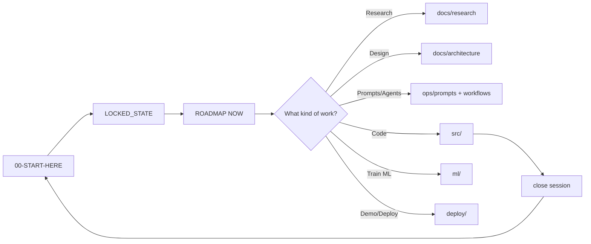

# PlantMind — START HERE (only entry point)

> **One folder. One truth. One next step.**  
> Path: `C:\Users\hp\Claude\Projects\PlantMind`  
> Last updated: 2026-06-29

---

## If you only remember one thing

| Question | Answer |
|---|---|
| **Where do I work?** | Always this folder: `PlantMind` |
| **What do I read first?** | This file → `LOCKED_STATE.md` → `ROADMAP.md` (NOW section) |
| **Where is the code?** | `src/` (build v2 here) · v1 runnable demo: `src/legacy/forge-v1/` |
| **Where are prompts?** | `ops/prompts/` |
| **Where is research?** | `docs/research/` |
| **How do I end a session?** | Say **"close session"** → updates `Chat Context/`, `ROADMAP.md`, git commit |

**Archives (read-only):** `_archive/PlantMind/20260629_snapshot-*`  
**New projects:** copy `_ProjectOS/` → `Projects\{NewName}/`

**Share with team / management:**
- `docs/deliverables/PlantMind_Ultra_Implementation_Team_Guide.docx` — **give this to engineers + TL**
- `docs/IMPLEMENTATION-GUIDE-ULTRA.md` — same content (Markdown)
- `docs/WIN-STRATEGY-ASSESSMENT.md` — honest win probability (no false guarantees)
- `docs/deliverables/PlantMind_Complete_Project_Blueprint.docx` — executive blueprint
- `docs/deliverables/PlantMind_Complete_Handover_Deck.pptx` — presentation
- `AI-OPERATING-SYSTEM.md` — Claude + Grok + Gemini rules (one folder)

**Multi-AI setup:** `AGENTS.md` (Grok) · `GEMINI.md` (Gemini) · `CLAUDE.md` (Claude)

See `MIGRATION-MAP.md` for the full old → new map.

---

## The 5 zones (mental model)

```
PlantMind/
│
├── 🧭 ROOT (you are here)     LOCKED_STATE · ROADMAP · Chat Context
│
├── 📚 docs/                   WHAT we believe (DNA, architecture, research)
├── ⚙️  ops/                    HOW we operate (prompts, skills, workflows, models)
├── 💻 src/                    WHAT we run (API, agents, dashboard)
├── 🧪 ml/                     HOW we train (data, synthesis, models)
└── 🚀 deploy/                 HOW we ship (local, Databricks)
```



---

## Task router — "I want to…"

| I want to… | Open / run | Lane |
|---|---|---|
| Know what's locked | `LOCKED_STATE.md` | — |
| See next steps | `ROADMAP.md` → NOW | — |
| Run research phase | `ops/prompts/research/` + save to `docs/research/` | Research |
| Start a build chat | `ops/prompts/lanes/` (pick Lane 1–5) | 1–5 |
| Add a model API | `ops/MODEL-REGISTRY.md` → then wire in `src/` | Backend |
| Write agent logic | `src/agents/` | Lane 1 |
| Physics / Weibull / synthetic data | `src/physics/` + `ml/synthesis/` | Lane 2 |
| Streamlit / dashboard | `src/dashboard/` | Lane 3 |
| FastAPI endpoint | `src/api/routes/` | Lane 1 |
| Shared schemas | `src/contracts/` (change = VAULT UPDATE) | Any |
| Train a model | `ml/training/notebooks/` | Lane 2 |
| Databricks port | `deploy/databricks/` | Lane 4 |
| Demo script / pitch | `ops/runbooks/demo.md` | Lane 5 |
| End session properly | Say **"close session"** to AI | — |

Full routing table: `ops/ROUTING.md`

---

## Session ritual (every time)

### START (2 minutes)
1. Open `PlantMind` in your editor / terminal
2. AI reads: `LOCKED_STATE.md` → latest `Chat Context/` → `ROADMAP.md`
3. AI tells you: **top 3 NOW items** — you pick one

### WORK
- Stay in one **lane** per chat (see `ops/prompts/lanes/`)
- Code changes only in `src/` or `ml/`
- Doc changes in `docs/` or `ops/`
- Contract changes → update `LOCKED_STATE.md` (vault update)

### CLOSE (5 minutes)
1. Move done items → ROADMAP DONE
2. Add ≥1 new HORIZON idea
3. New `Chat Context/YYYY-MM-DD_vX.Y_project-context.md`
4. `git commit`

---

## Architecture layers (modular spine)

Everything plugs into **contracts** in `src/contracts/`:

```
Data → Physics → Agents → API → Dashboard
         ↑           ↑
    ml/synthesis   ops/workflows
```

| Module | Folder | Owns |
|---|---|---|
| Contracts | `src/contracts/` | Pydantic schemas (the API between lanes) |
| Physics | `src/physics/` | Weibull, health, RUL |
| Agents | `src/agents/` | 5 agents + orchestrator |
| Pipeline | `src/pipeline/` | LangGraph / workflow wiring |
| API | `src/api/` | FastAPI routes |
| Dashboard | `src/dashboard/` | Streamlit |
| Governance | `src/governance/` | Audit log, lineage |
| RAG | `src/rag/` | ChromaDB, embeddings |

**Rule:** Lanes talk through `contracts/` only — never reach into another lane's internals.

---

## v1 FORGE vs v2 target (honest status)

| | v1 (built) | v2 (target) |
|---|---|---|
| Location | `src/legacy/forge-v1/` | `src/` here |
| Model | 5 layers, MetaGPT, G-score | 5 agents, IIS, Weibull |
| Demo | Streamlit RED→GREEN | 5-agent + human approve |
| Status | **Runnable today** | **Scaffolded, migrate incrementally** |

**Hackathon strategy (locked in ROADMAP):** ship v1 demo if time-critical; migrate modules into `src/` as lanes complete.

---

## Quick commands (PowerShell)

```powershell
# Always start here
cd "C:\Users\hp\Claude\Projects\PlantMind"

# Run v1 demo (until src/dashboard is wired)
streamlit run src\legacy\forge-v1\app.py

# Session start (any AI tool)
.\scripts\start-session.ps1

# Future v2:
# streamlit run src/dashboard/app.py
# uvicorn src.api.main:app --reload
```

---

## Files at root (what each does)

| File | Purpose |
|---|---|
| `00-START-HERE.md` | This file — operating manual |
| `LOCKED_STATE.md` | Canonical locked decisions |
| `ROADMAP.md` | Living backlog (NOW / NEXT / HORIZON) |
| `CLAUDE.md` | Tells AI to read this file first |
| `CLAUDE_RULES.md` | Coding + session rules |
| `MIGRATION-MAP.md` | Old folders → new zones |
| `Chat Context/` | Versioned session memory |

---

*You forget less when every question routes to one folder and one table.*