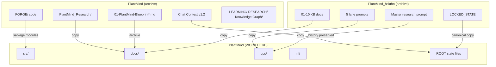

# Migration Map — archives → PlantMind (active)

> **Completed 2026-06-29.** Archives at `../PlantMind_Archive/` (sibling of live).
> **Phase 0 (2026-06-30):** Portfolio `Projects/PlantMind/` → `PlantMind_live` + `PlantMind_OS` + `PlantMind_Archive` + `PlantMind_GitHub`.

> Absorb, don't duplicate. Old folders become **read-only archives** once content is migrated.

---

## Folder lineage

---

## File-by-file map

| Old location | New location | Action |
|---|---|---|
| `PlantMind_hckthn/LOCKED_STATE.md` | `LOCKED_STATE.md` | ✅ Copied (canonical) |
| `PlantMind_hckthn/02_PROJECT_DNA.md` | `docs/dna/PROJECT_DNA.md` | Copy when ready |
| `PlantMind_hckthn/03-10_*.md` | `docs/architecture/` | Copy when ready |
| `PlantMind_hckthn/PLANTMIND_5_CHAT_PROMPTS.md` | `ops/prompts/lanes/` | Split per lane |
| `PlantMind_hckthn/PLANTMIND_MASTER_RESEARCH_PROMPT_v2.md` | `ops/prompts/research/` | Copy when ready |
| `PlantMind_hckthn/PLANTMIND_PROJECT_CUSTOM_INSTRUCTION.md` | `ops/PROJECT_CUSTOM_INSTRUCTION.md` | Copy when ready |
| `PlantMind/PlantMind_Research/*.md` | `docs/research/` | Copy when ready |
| `PlantMind/FORGE/` | `src/` (incremental) | Migrate module by module |
| `PlantMind/01-PlantMind-Blueprint*.md` | `docs/legacy/` | Archive (v1 design) |
| `PlantMind/Chat Context/` | `Chat Context/` | New versions only here forward |
| `PlantMind/ROADMAP.md` | `ROADMAP.md` | Superseded by Live ROADMAP |
| `PlantMind/Knowledge Graph/` | `knowledge/` | Move or symlink Obsidian vault |

---

## Migration phases

| Phase | What | When |
|---|---|---|
| **0 — NOW** | Scaffold Live + operating docs | ✅ Done 2026-06-29 |
| **1** | Copy vault KB + research into `docs/` | ✅ Done 2026-06-29 |
| **1b** | Consolidated blueprint + Word + PPT | ✅ Done 2026-06-29 |
| **2** | Copy prompts into `ops/prompts/` | Next session |
| **3** | Extract `FORGE/src/contracts` → `src/contracts/` | Before Lane 1 build |
| **4** | Port `gotze_engine` → `src/agents/gotze_engine.py` (IIS refactor) | Lane 1 |
| **5** | Port Streamlit → `src/dashboard/` | Lane 3 |
| **6** | Retire writes to old folders | After hackathon |

---

## Do NOT delete old folders yet

Keep `PlantMind/` and `PlantMind_hckthn/` until:
- [ ] v1 demo runs from `src/dashboard/` OR hackathon ships from FORGE with Live as control plane
- [ ] All LOCKED_STATE contracts exist in `src/contracts/`
- [ ] Git remote set on PlantMind