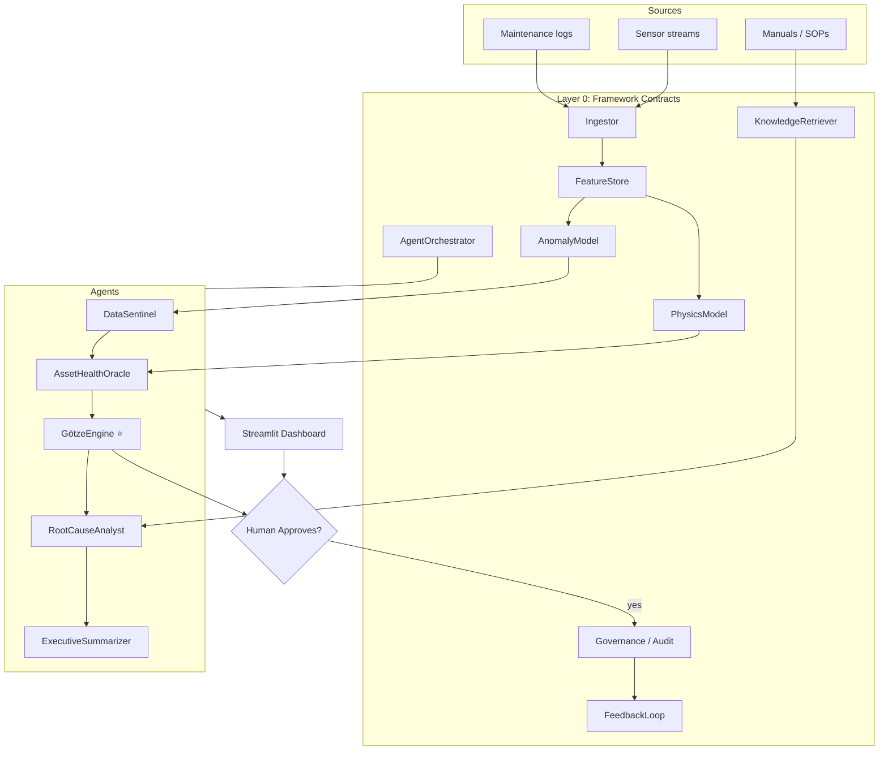
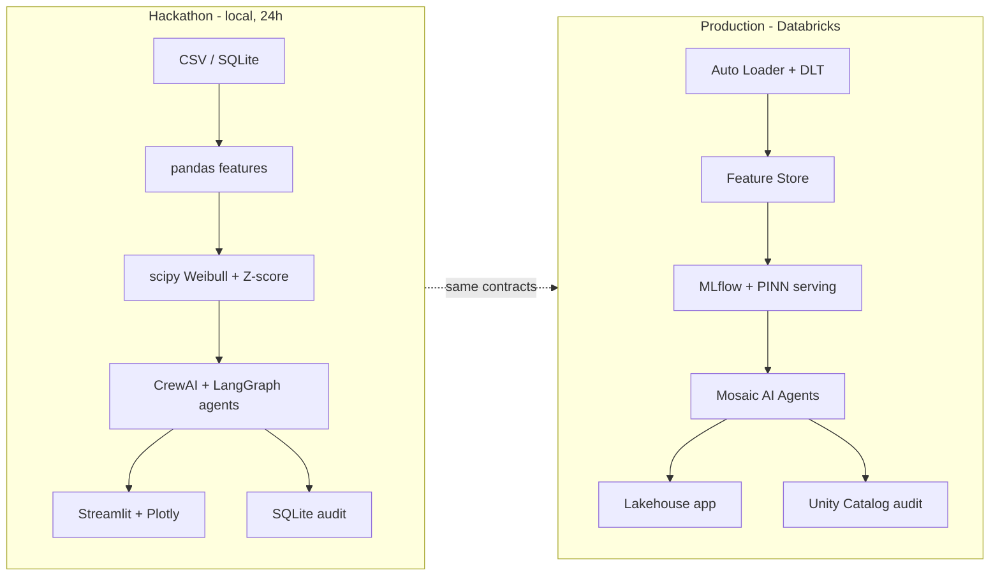

# ARCHITECTURE — PlantMind × Götze Engine
> The full system, both layers, with the exact tool/model lineage to code and phases. Diagrams are Mermaid (render in GitHub).

---

## 1. The two layers (why this design)

- **Layer 0 — Framework (LTTS IP):** interface contracts that describe *what* each part must do, with no dependence on any vendor. This is the portable intellectual property — it can run on Databricks, AWS, or a laptop.
- **Layer 1 — Reference implementation:** concrete tech that satisfies the contracts. We ship **two** bindings: a **local open-source build** (the hackathon demo) and a **Databricks-native** mapping (the production narrative judges care about, given the partnership).

This separation is itself a selling point: *"the framework is tool-agnostic LTTS IP; Databricks is the reference runtime."*

---

## 2. Layer 0 — the interface contracts

| Contract | Responsibility |
|---|---|
| `IngestorInterface` | Pull sensor/maintenance data in, validate schema + quality |
| `FeatureStoreInterface` | Serve point-in-time features (incl. physics features) |
| `AnomalyModelInterface` | Detect abnormal behavior per asset/window |
| `PhysicsModelInterface` ⭐ | Wrap Weibull/Arrhenius into a callable health+RUL contract |
| `KnowledgeRetrieverInterface` | Retrieve from manuals/logs for explanations (RAG) |
| `AgentOrchestratorInterface` | Trigger agents, route tools, attach audit + IIS |
| `GovernanceInterface` | Lineage, access policy, audit trail, explainability |
| `FeedbackLoopInterface` | Capture outcomes → (production) retrain/recalibrate |

> Hackathon reality: implement these as plain Python classes/Pydantic models. They don't need to be fancy — they need to be *consistent* so the demo holds together.

---

## 3. Layer 1 — tool/model lineage (the exact mapping)

| Contract | Hackathon (local, build now) | Production (Databricks narrative) | Code module |
|---|---|---|---|
| Ingestor | Python reader + Pydantic validation over SQLite/CSV | Auto Loader + Delta Live Tables (Bronze→Silver→Gold) | `ingest/` |
| FeatureStore | pandas feature builder | Databricks Feature Store | `features/` |
| AnomalyModel | Z-score + Mahalanobis (scikit-learn) | MLflow model serving | `agents/data_sentinel.py` |
| PhysicsModel ⭐ | scipy Weibull + optional PyTorch PINN | Python wheel on cluster | `physics/` |
| KnowledgeRetriever | ChromaDB + `all-MiniLM-L6-v2` | Vector Search + Foundation Model API | `rag/` |
| Orchestrator | CrewAI + LangGraph | Mosaic AI Agents | `agents/orchestrator.py` |
| Governance | SQLite audit table + lineage dict | Unity Catalog + Lakehouse Monitoring | `governance/` |
| FeedbackLoop | SQLite outcomes table | Delta tables + Workflows retrain | `feedback/` |

**Model routing (cost control):**
| Task | Model |
|---|---|
| Runtime agent narrative | Groq Llama 3.3 70B (free) |
| Heavy reasoning (RootCause) | DeepSeek R1 (cheap) or Groq |
| Summaries / classification | Groq Llama 3.2 3B |
| Embeddings | `all-MiniLM-L6-v2` (local) |
| Architecture / IP writing only | Claude Opus 4.8 |

---

## 4. Diagram A — system architecture



---

## 5. Diagram B — hackathon vs production (side by side)



---

## 6. Folder structure (the repo)

```
plantmind/
├── ingest/            # IngestorInterface impl
├── features/          # feature builders (incl. physics features)
├── physics/           # Weibull model + optional PINN
├── agents/            # 5 agents + orchestrator
│   ├── data_sentinel.py
│   ├── asset_health_oracle.py
│   ├── gotze_engine.py
│   ├── root_cause_analyst.py
│   ├── executive_summarizer.py
│   └── orchestrator.py
├── rag/               # ChromaDB + embeddings
├── governance/        # audit + lineage
├── feedback/          # outcome capture
├── api/               # FastAPI endpoints
├── dashboard/         # Streamlit app
├── data/              # synthetic + Kaggle seeds
└── scripts/           # calibrate_weibull.py, generate_data.py, seed_rag.py
```

> Full code for each module is staged for the build chat (`07_ML_MODEL_AND_DATA.md` covers the physics/ML; the rest comes as a code drop).
