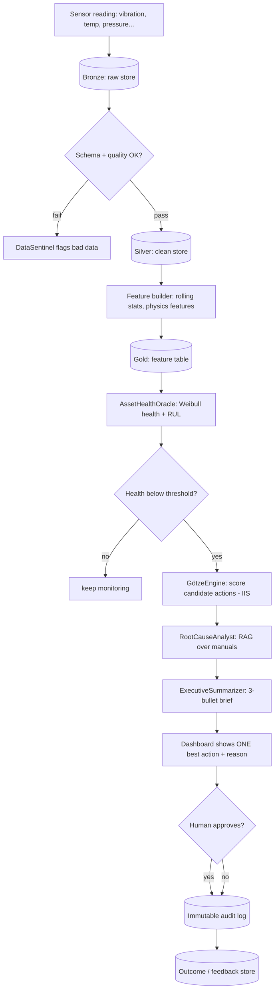

# DATA FLOW — PlantMind × Götze Engine
> How a single reading travels from a sensor to an approved, logged decision.

---

## 1. The medallion pipeline (Bronze → Silver → Gold)

This is the same pattern you already know from data engineering — raw, cleaned, ready-to-use.

| Layer | Contains | Hackathon | Production |
|---|---|---|---|
| **Bronze** | Raw sensor rows, untouched | CSV / SQLite table | Auto Loader → Delta |
| **Silver** | Validated, deduped, typed | pandas + Pydantic | Delta Live Tables |
| **Gold** | Features + health + RUL, ready for agents | feature builder | Feature Store |

---

## 2. Diagram — end-to-end flow



---

## 3. What each signal looks like (the synthetic schema)

Per asset, per cycle (timestep):

```
asset_id, cycle, timestamp,
vibration_rms, temperature, pressure, flow_rate, current_draw,
torque, speed_rpm, noise_db, lubrication_level,
+ 11 derived features (rolling mean/std, deltas, ratios),
health_index (computed), rul_days (computed), failure_mode (label)
```

Assets: `pump · compressor · motor · bearing · valve`
Failure modes: `gradual_wear` (Weibull) · `sudden_impact` (step) · `intermittent_fault` (periodic spike)

---

## 4. The three "physics features" (what makes it physics-informed)

Beyond raw sensors, the Gold layer computes:
1. **Degradation rate** — slope of health over recent cycles.
2. **Temperature stress factor** — Arrhenius correction (failure accelerates with heat).
3. **Load stress factor** — load relative to rated capacity.

These feed both the health model and the IIS feasibility/safety terms.

---

## 5. Trigger logic (when does the Götze Engine wake up?)

```
IF health_index < HEALTH_THRESHOLD (default 40)
   OR rul_days < RUL_THRESHOLD (default 14)
   OR DataSentinel severity == "critical"
THEN invoke GötzeEngine
```

Keep thresholds in a config file so you can tune them live for the demo (`plant_config.yaml`).

---

## 6. Where data is stored (hackathon)

| Store | Tech | Purpose |
|---|---|---|
| Bronze/Silver/Gold | SQLite (or parquet) | the pipeline tables |
| Vectors | ChromaDB | manuals/logs for RAG |
| Audit | SQLite `audit_log` table | every decision + approval |
| Outcomes | SQLite `feedback` table | for the production retrain story |

> Production swaps every store for Delta Lake under Unity Catalog — same shapes, same flow.
