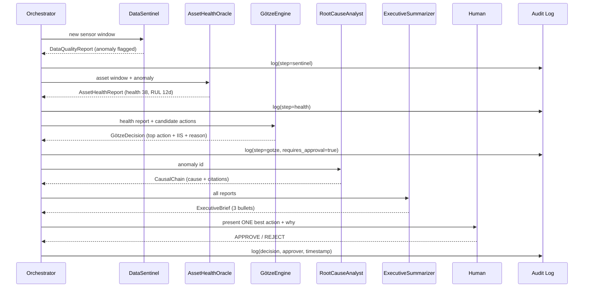

# RUNTIME & AGENTIC WORKFLOW — PlantMind × Götze Engine
> Exactly what happens, step by step, when a machine starts to fail. This is the runtime story behind the demo.

---

## 1. The orchestration model

The 5 agents run as a **directed sequence** (a LangGraph state machine), not a free-for-all. Each agent's output is the next agent's input. The orchestrator attaches an audit record at every hop.



---

## 2. Step-by-step (what each step produces)

**Step 1 — DataSentinel (the inspector)**
- Input: latest sensor window for an asset.
- Does: Z-score per signal + Mahalanobis distance across signals → typed anomaly.
- Output: `DataQualityReport(asset_id, signal_id, anomaly_type, severity, ts)`
- Rule: **flags only, never modifies data.**

**Step 2 — AssetHealthOracle (the doctor)**
- Input: sensor window + anomaly flag.
- Does: runs the Weibull health model → `H(t)`; estimates RUL + 95% confidence interval.
- Output: `AssetHealthReport(asset_id, health_score, rul_days, ci_95, physics_text)`
- Rule: **scores and reports only.**

**Step 3 — GötzeEngine (the coach) ⭐**
- Input: health report + candidate interventions + crew availability + parts inventory + plant config (weights).
- Does: computes **IIS** for every candidate, ranks them, asks Groq Llama 3.3 70B for a 3-sentence reason for the winner.
- Output: `GötzeDecision(top_intervention, iis_score, runner_up, iis_gap, narrative, confidence, requires_human_approval=True)`
- Rule: **requires human approval before any action is logged as taken.**

**Step 4 — RootCauseAnalyst (the detective)**
- Input: anomaly id.
- Does: RAG over ChromaDB (manuals, fault logs, SOPs) → builds a causal chain with citations + finds similar past faults.
- Output: `CausalChain(anomaly_id, steps, citations, confidence, similar_past_faults)`

**Step 5 — ExecutiveSummarizer (the chief of staff)**
- Input: all reports.
- Does: aggregates → 3-bullet brief + rough ROI impact.
- Output: `ExecutiveBrief(critical_alerts, gotze_pending, downtime_saved_estimate)`

→ **Human approves → orchestrator writes the final immutable decision record.**

---

## 3. The candidate interventions (what the coach chooses between)

A fixed menu per asset type, e.g. for a pump:
```
- reduce_load_now
- swap_mechanical_seal (needs part + crew)
- schedule_maintenance_next_window
- run_to_planned_shutdown
- emergency_stop
```
Each candidate carries: estimated ΔP_failure, downtime cost, feasibility (crew/parts available?), historical success rate, safety risk delta. The IIS turns these five numbers into one score.

---

## 4. State object (what flows between agents)

```python
class PlantMindState(BaseModel):
    asset_id: str
    sensor_window: list[dict]
    quality_report: DataQualityReport | None = None
    health_report: AssetHealthReport | None = None
    gotze_decision: GotzeDecision | None = None
    causal_chain: CausalChain | None = None
    exec_brief: ExecutiveBrief | None = None
    audit_trail: list[dict] = []
    human_decision: str | None = None   # "approved" | "rejected" | None
```

One object, enriched at each step, fully logged. This is what makes the audit trail trivial: log the state after every agent.

---

## 5. Failure-of-the-agents handling (so the demo never dies)

| If this breaks | Fallback |
|---|---|
| Groq API is down/slow | Use a templated reason string (pre-written per action) |
| PINN not ready | Analytical Weibull health (always available) |
| RAG returns nothing | RootCause returns "cause uncertain — manual review" with confidence=low |
| Any agent throws | Orchestrator logs the error, shows partial result, demo continues |

> **Design principle: every agent degrades gracefully. The "one best action" panel must render even if two agents fail.**
