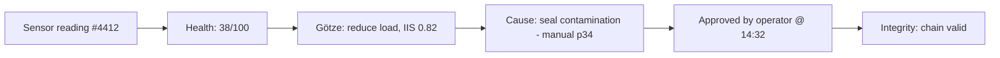

# LOGGING & AUDIT — PlantMind × Götze Engine
> How everything gets logged and shown in the app, at every phase. Governance is a feature judges reward, not an afterthought.

---

## 1. The principle

**Every decision is traceable, explainable, and immutable.** If a judge asks "why did it recommend that, and who approved it?" — you have the answer on screen in two clicks. This is the `GovernanceInterface` contract made real.

---

## 2. What gets logged (the four log streams)

| Stream | Captures | Table |
|---|---|---|
| **Pipeline log** | every Bronze→Silver→Gold transform, row counts, quality results | `pipeline_log` |
| **Agent log** | each agent invocation: input hash, output, latency, model used | `agent_log` |
| **Decision log** ⭐ | every Götze recommendation + IIS + runner-up + reason | `decision_log` |
| **Approval log** ⭐ | human approve/reject, who, when, why | `approval_log` |

---

## 3. The canonical audit record (one schema, everywhere)

```python
class AuditRecord(BaseModel):
    record_id: str            # uuid
    timestamp: datetime
    asset_id: str
    stage: str                # sentinel | health | gotze | rootcause | summary | approval
    actor: str                # agent name OR human user id
    model_used: str | None    # e.g. "groq/llama-3.3-70b"
    input_ref: str            # hash or pointer to input state
    output: dict              # the agent's output
    iis_score: float | None
    requires_approval: bool
    decision: str | None      # approved | rejected | None
    reason: str | None
    lineage: list[str]        # ids of upstream records
```

> `lineage` is the magic field — it lets you reconstruct the full chain from sensor reading to approved action.

---

## 4. Immutability (cheap, convincing)

- Hackathon: **append-only** table + a per-record `prev_hash` (hash of the previous record). Tampering breaks the chain → visibly detectable.
```python
record.hash = sha256(prev_hash + record.json())
```
- This gives you a "blockchain-lite" audit story without any blockchain. Judges find it credible.
- Production: Unity Catalog + Delta time-travel = real immutability + lineage for free.

---

## 5. How it shows in the app (the audit UI)

Three views in the dashboard:

1. **Decision Timeline** — a scrollable feed of every recommendation + its approval state. Click any item → expands to the full chain.
2. **Lineage View** — for a selected decision, a small graph: sensor → health → IIS → cause → approval. (Reuse the Mermaid/flow style.)
3. **Integrity Check** — a button that re-walks the hash chain and shows ✅ "audit intact" or ❌ "tampering detected." Great live demo beat.



---

## 6. Logging across the phases

| Phase | What logging proves |
|---|---|
| **Hackathon (SQLite)** | every decision + approval is captured and replayable |
| **Production (Databricks)** | Unity Catalog lineage + Lakehouse Monitoring + Delta time-travel |
| **Feedback loop** | approve/reject outcomes feed `feedback` table → (production) weight recalibration |

The *same* `AuditRecord` schema works in both — only the storage swaps (SQLite → Delta). Say this: **"our governance contract is tool-agnostic; the audit looks identical on a laptop or on Databricks."**

---

## 7. One-paragraph governance pitch line

> "PlantMind never acts on its own. Every recommendation is scored, explained, and logged with full lineage; every action is human-approved; and the audit chain is tamper-evident. On Databricks, that's Unity Catalog and Delta time-travel. On our laptop demo, it's an append-only hash chain. Either way, you can answer *what, why, and who* for every decision — which is the bar for deploying AI in a real plant."
